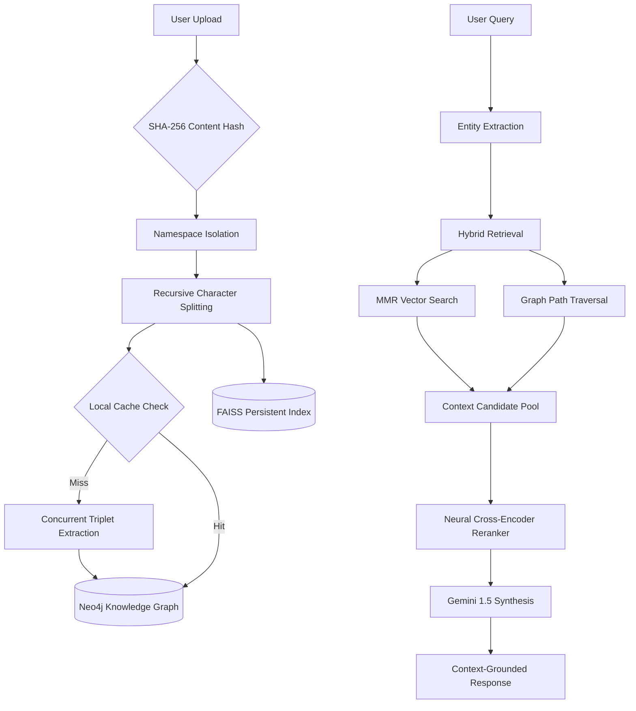

#  AI Research Partner — Hybrid GraphRAG Knowledge System

[](https://www.python.org/)
[](https://neo4j.com/)
[](https://python.langchain.com/)
[](https://github.com/facebookresearch/faiss)
[](https://ai.google.dev/)
[](LICENSE)

An AI-driven research assistant implementing a **Hybrid GraphRAG** architecture. The system combines structured knowledge graph traversal, semantic vector retrieval, and neural reranking to analyze technical documents with high contextual precision.

---

##  Overview

The **AI Research Partner** addresses the "context-fragmentation" problem in standard RAG implementations. While traditional vector search identifies semantically related passages, it often fails to capture explicit structural relationships between technical concepts. 

This system constructs document-specific **Knowledge Graphs** in Neo4j and fuses them with **FAISS** semantic retrieval. By applying a **Cross-Encoder reranking** pass, the assistant identifies the most relevant facts from both sources before synthesizing a response via Gemini 1.5 Flash.

---

##  Features

*   **Content-Addressed Namespace Isolation:** Uses SHA-256 signatures of document content to ensure idempotent ingestion and prevent data bleeding between different sources.
*   **Hybrid Retrieval Pipeline:** Combines semantic retrieval (MMR-based vector search) with structural retrieval (2-hop graph path traversal).
*   **Cross-Encoder Reranking:** Re-scores context candidates using a neural reranker (`ms-marco-MiniLM`) to optimize the signal-to-noise ratio before synthesis.
*   **Concurrent Extraction Caching:** Local JSON-based caching of extracted triplets reuses results for identical chunks, minimizing LLM API overhead.
*   **Resilient Execution:** Implements exponential backoff retries for database and API interactions using `tenacity`.
*   **Process-Safe Cache Access:** Utilizes `portalocker` and atomic `os.replace` to manage concurrent file I/O during extraction.

---

##  Architecture

### Logic Flow


---

##  Repository Structure

```text
.
├── app.py                # UI orchestration & session management
├── config.py             # Settings (Pydantic) & Resource singletons
├── data_processing.py    # Content addressing & Document loaders
├── graph_db.py           # Neo4j engine, Entity resolution & Ingestion logic
├── qa_chain.py           # Reranking logic & RAG Orchestrator
├── schemas.py            # Pydantic V2 Models for Graph triplets
├── vector_store.py       # FAISS persistence & retriever configuration
├── storage/              # Local persistent state
│   ├── cache/            # Triplet extraction caches (JSON)
│   └── vector/           # Namespaced FAISS indices
└── requirements.txt      # Pinned production dependencies
```

---

##  Technology Stack

| Layer | Technology |
| :--- | :--- |
| **LLM** | Google Gemini 2.5 Flash |
| **Graph Database** | Neo4j 5.x (Cypher) |
| **Vector Database** | FAISS (Local persistence) |
| **Reranker** | `cross-encoder/ms-marco-MiniLM-L-6-v2` |
| **Embeddings** | `all-MiniLM-L6-v2` (HuggingFace) |
| **Orchestration** | LangChain & Pydantic V2 |
| **Safety** | Tenacity (Retries) & Portalocker (File Locking) |

---

##  Example Workflow

1.  **Ingestion:** User uploads a PDF. The system calculates a SHA-256 hash to determine the `namespace`.
2.  **Chunking:** The document is split into 1000-character segments with 150-character overlap.
3.  **Extraction:** The system checks `storage/cache/triplets`. On a miss, it uses Gemini to extract relationships (limited to 2 concurrent workers via `BoundedSemaphore`).
4.  **Indexing:** Triplets are merged into Neo4j; text chunks are stored in a namespaced FAISS index.
5.  **Querying:** A user asks a question. The system extracts technical entities and retrieves the top 10 chunks and relevant graph facts.
6.  **Reranking:** The Cross-Encoder selects the top 5 most relevant items.
7.  **Synthesis:** Gemini generates a grounded response using the filtered context.

---

##  Detailed Module Documentation

### `graph_db.py`
Manages the structural knowledge graph lifecycle.
*   **Entity Resolution:** Deterministic normalization via `EntityResolver` standardizes technical names (e.g., GPT-4, BERT) while title-casing general concepts.
*   **Whitelisting:** Enforces a schema of allowed relationship types (e.g., `USES`, `IMPLEMENTS`, `TRAINED_ON`) to prevent graph noise.
*   **Ingestion:** Implements `UNWIND` batching for efficient Neo4j MERGE operations.

### `qa_chain.py`
The neural reranking and orchestration layer.
*   **RAGOrchestrator:** Encapsulates the `CrossEncoder` logic, re-scoring vector chunks and graph facts against the user query to maximize synthesis quality.

### `data_processing.py`
Handles data integrity and hashing.
*   **get_namespace():** Generates a unique signature from file bytes to ensure document isolation.
*   **get_chunk_hash():** Versioned hashing for cache invalidation.

---

##  Security & Resilience

*   **Access Control:** Access is managed via a `SaaS Token` sidebar gate (configured in `settings.py`).
*   **Rate Limiting:** A `BoundedSemaphore(2)` prevents API 429 errors by throttling concurrent extraction calls.
*   **Cypher Safety:** Uses strict relation whitelisting and parameterized queries to eliminate injection risks.
*   **Atomicity:** Uses `os.replace` for cache writes to prevent file corruption during parallel processing.

---

##  Limitations

*   **Synchronous Ingestion:** Ingestion occurs within the Streamlit request cycle; large documents may impact UI responsiveness.
*   **Local State Dependency:** FAISS indices and extraction caches are stored on the local filesystem, requiring persistent volumes for containerized deployments.
*   **Compute-Bound Reranking:** Neural reranking is performed on the application CPU, which may impact latency under high concurrent load.

---

##  Design Decisions

*   **Why SHA-256 Content Hashing?** Enables document idempotency. Re-processing identical content results in a sub-second "load" operation rather than redundant LLM extraction.
*   **Why Neo4j?** Supports multi-hop path traversals (depth 1-2) to identify explicit concept links that are ignored by vector-only similarity search.
*   **Why Cross-Encoder Reranking?** Vector search identifies *similarity*, but Cross-Encoders identify *relevance*. This two-stage approach provides a higher-density context window for the LLM.

---

##  Installation & Setup

1.  **Dependencies:**
    ```bash
    pip install -r requirements.txt
    ```
2.  **Configuration:**
    Set the following in `.streamlit/secrets.toml`:
    ```toml
    GOOGLE_API_KEY = "..."
    NEO4J_URI = "..."
    NEO4J_USERNAME = "..."
    NEO4J_PASSWORD = "..."
    APP_TOKEN = "..."
    ```
3.  **Run:**
    ```bash
    streamlit run app.py
    ```

---

##  License

This project is licensed under the MIT License.

---

## 🙏 Acknowledgements

*   **Neo4j** for GraphRAG infrastructure.
*   **Google AI** for the Gemini 1.5 reasoning engine.
*   **HuggingFace** for the neural reranking models and embeddings.
